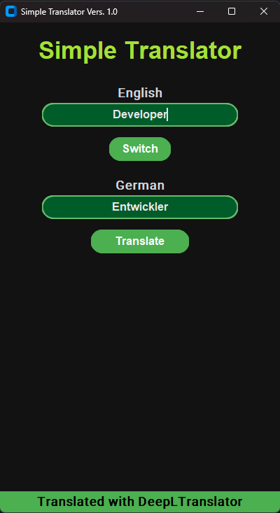
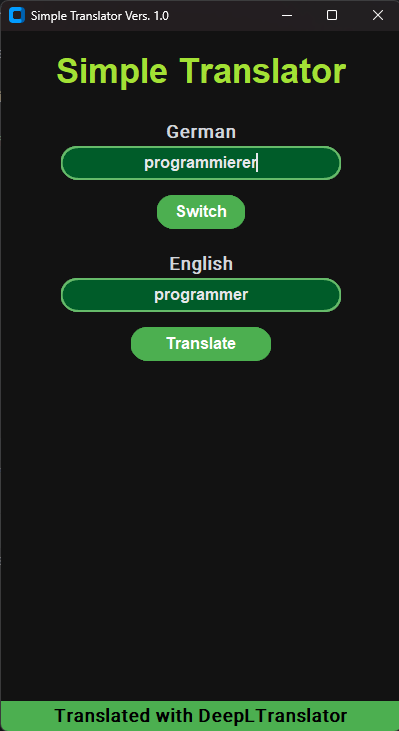
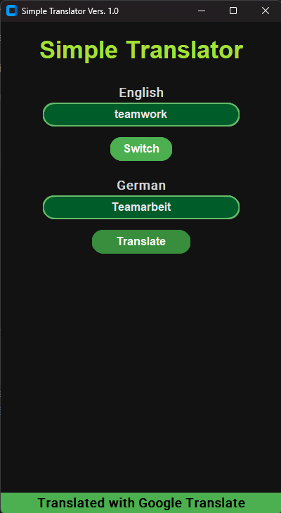
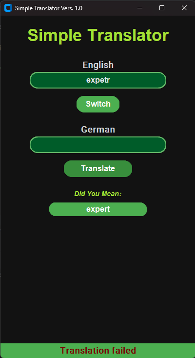

# **Simple Translator - CS50 Final Project Documentation**


## Screenshots



*Example of an English-to-German translation using DeepL*
<div style="margin-bottom: 35px;"></div>



*Example of a German-to-English translation using DeepL*
<div style="margin-bottom: 35px;"></div>



*Example of the fallback mechanism: If DeepL fails, Google Translate is used*
<div style="margin-bottom: 35px;"></div>



*Example of fuzzy search suggesting correct spelling*
<div style="margin-bottom: 35px;"></div>

---

## Language Selection / Sprachauswahl
- **[English Version](#english-version)**
- **[Deutsche Version](#deutsche-version)**

---

# **English Version**

## **1. Overview**
The Simple Translator is a powerful and flexible translation tool developed as part of the **CS50 Final Project**. It leverages modern software design patterns to provide a robust translation service using multiple APIs. This project meets the CS50 requirements by:
- **Implementing object-oriented programming (OOP)** with classes and inheritance.
- **Using at least three additional functions** within `project.py`.
- **Providing unit tests** in `test_project.py`.
- **Securely storing API credentials** in `config.json`.
- **Including a comprehensive README and a video demonstration**.

The project is designed to be **modular and scalable**, allowing additional translation APIs to be added easily.

---

## **2. Key Features**
### **Fallback Mechanism**
One of the most important features of the Simple Translator is its **fallback mechanism**. It ensures that if one translation service (e.g., **DeepL**) fails due to an API outage or incorrect credentials, the system will automatically switch to an alternative service (**Google Translate**). This guarantees continuous functionality and prevents translation failures.

The fallback mechanism is implemented using the **Strategy Pattern**, which allows dynamic selection of an appropriate translation service at runtime.

### **Fuzzy Search (Typo Correction)**
The application includes a **fuzzy search algorithm** that helps users find the correct spelling of words. This feature is particularly useful if a word is misspelled or does not exist in the dictionary.

- It uses the **Damerau-Levenshtein algorithm** to determine the similarity between words.
- Provides real-time **suggestions** for misspelled input.
- Ensures users receive **accurate translations** even with typing errors.

### **Strategy Pattern (Translation APIs)**
The project follows the **Strategy Pattern**, which is crucial for managing multiple translation services efficiently. Instead of hardcoding the API calls, the system:
- Defines a **common interface (`TranslatorStrategy`)** for all translation services.
- Implements multiple strategies (`DeepLTranslator`, `GoogleTranslator`).
- Uses a **fallback strategy (`FallbackTranslator`)** to switch between services dynamically.

This design ensures that new translation services can be added in the future **without modifying the core logic**.

---

## **3. Installation & Usage**
### **Install Dependencies**
```bash
pip install -r requirements.txt
```

### **Run the Translator**
```bash
python project.py
```

---

## **4️. Testing (`test_project.py`)**
### **Running the Tests**
```bash
pytest test_project.py --disable-warnings
```

---

## **License & Author**

### **MIT License**
This project is licensed under the **MIT License**. See the `LICENSE` file for more details.

### **HarvardX License**
This project follows the **CC BY-NC-SA 4.0** *(Creative Commons Attribution-NonCommercial-ShareAlike 4.0 International Public License)*.
More information: [Creative Commons License](https://creativecommons.org/licenses/by-nc-sa/4.0/)

### **Contact**
- **Author:** Pawel Sala
- **Email:** [pawel.sala@web.de](mailto:pawel.sala@web.de)
- **GitHub:** [PawelUKS](https://github.com/PawelUKS)

For any questions, issues, or suggestions, feel free to contact me or open an issue on GitHub.

---

# **Deutsche Version**

## **1. Überblick**
Der **Simple Translator** ist ein leistungsstarkes Übersetzungstool, das für das **CS50 Abschlussprojekt** entwickelt wurde. Es nutzt moderne Software-Design-Patterns und erfüllt die CS50-Anforderungen durch:
- **Objektorientierte Programmierung (OOP)** mit Klassen und Vererbung.
- **Mindestens drei zusätzliche Funktionen** in `project.py`.
- **Unit Tests** in `test_project.py`.
- **Sichere Speicherung von API-Zugangsdaten** in `config.json`.
- **Eine ausführliche README und eine Video-Demonstration**.

Das Projekt ist **modular und erweiterbar**, sodass weitere Übersetzungs-APIs leicht hinzugefügt werden können.

---

## **2. Hauptfunktionen**
### **Fallback-Mechanismus**
Eine der wichtigsten Funktionen des Simple Translators ist sein **Fallback-Mechanismus**. Falls ein Übersetzungsdienst (z. B. DeepL) aufgrund eines API-Ausfalls oder falscher Zugangsdaten nicht verfügbar ist, wechselt das System automatisch zu einem alternativen Dienst (Google Translate). Dies gewährleistet eine durchgehende Funktionalität und verhindert Übersetzungsfehler.

Der Fallback-Mechanismus basiert auf dem **Strategy Pattern**, das die dynamische Auswahl eines geeigneten Übersetzungsdienstes zur Laufzeit ermöglicht.
### **Unscharfe Suche (Tippfehlerkorrektur)**
Die Anwendung nutzt einen **Fuzzy-Search-Algorithmus (unscharfe Suche)**, um die korrekte Schreibweise von Wörtern zu finden – besonders hilfreich bei Tippfehlern oder unbekannten Wörtern.

- **Damerau-Levenshtein-Algorithmus** bestimmt die Ähnlichkeit zwischen Wörtern.
- Bietet **Echtzeit-Vorschläge** für falsch geschriebene Wörter.  
- Stellt sicher, dass Nutzer selbst bei Tippfehlern **korrekte Übersetzungen** erhalten.

### **Strategy Pattern (Übersetzungs-APIs)**
Das Projekt nutzt das **Strategy Pattern**, um mehrere Übersetzungsdienste effizient zu verwalten:

- Definiert eine **gemeinsame Schnittstelle** (`TranslatorStrategy`) für alle Übersetzungsdienste.
- Implementiert mehrere Strategien (`DeepLTranslator`, `GoogleTranslator`).
- Nutzt eine **Fallback-Strategie** (`FallbackTranslator`), um Dienste dynamisch zu wechseln.

Diese Architektur ermöglicht die einfache Integration neuer Übersetzungsdienste, **ohne die Kernlogik zu ändern**.

---

## **3. Installation & Nutzung**
### **Abhängigkeiten installieren**
```bash
pip install -r requirements.txt
```

### **Programm starten**
```bash
python project.py
```

---

## **4. Tests (`test_project.py`)**
### **Tests ausführen**
```bash
pytest test_project.py --disable-warnings
```

---

## **Lizenz & Autor**

### **MIT-Lizenz**
Dieses Projekt ist unter der **MIT-Lizenz** lizenziert. Weitere Informationen finden Sie in der `LICENSE`-Datei.

### **HarvardX Lizenz**
Dieses Projekt folgt der **CC BY-NC-SA 4.0** *(Creative Commons Attribution-NonCommercial-ShareAlike 4.0 International Public License)*.
Mehr Informationen: [Creative Commons Lizenz](https://creativecommons.org/licenses/by-nc-sa/4.0/)

### **Kontakt**
- **Autor:** Pawel Sala  
- **E-Mail:** [pawel.sala@web.de](mailto:pawel.sala@web.de)  
- **GitHub:** [PawelUKS](https://github.com/PawelUKS)  

Bei Fragen, Problemen oder Verbesserungsvorschlägen können Sie mich gerne kontaktieren oder ein Issue im GitHub-Repository erstellen.

---


